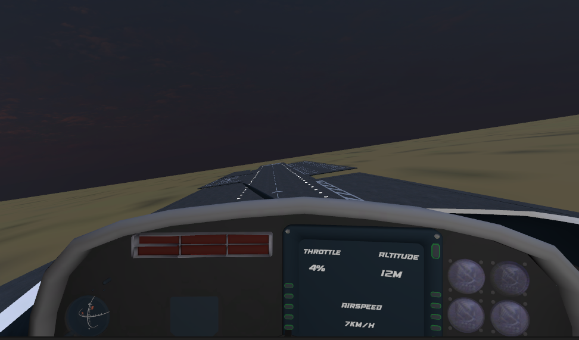
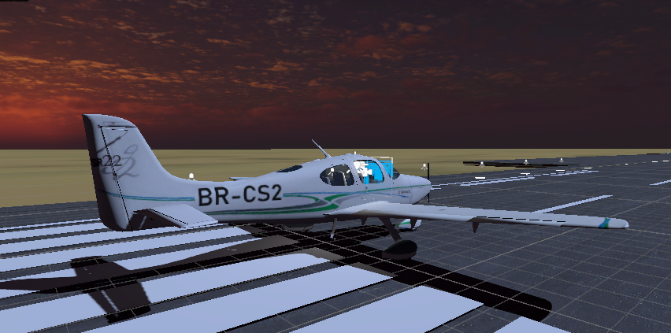

Here’s a README file that provides an overview and setup instructions for your GitHub project. It describes the purpose of the project, setup steps, and usage examples.

---

# AirCraft Controller - Unity XR Full Control Plane

This project is a Unity-based XR (Extended Reality) control plane system, designed to simulate an aircraft's full control through an XR joystick and knob for immersive interaction. The `AirCraftController` script enables realistic flight dynamics such as throttle, yaw, pitch, roll, and lift adjustments.

## Project Overview

The `AirCraftController` class is designed to simulate aircraft controls using Unity's XR interaction toolkit, focusing on flight control physics and responsiveness. It allows users to interact with an XR joystick and knob to control an aircraft’s movement in real time.

### Key Features

- **Throttle Control**: Allows throttle adjustment to control the aircraft's speed.
- **Directional Control**: Uses yaw, pitch, and roll for realistic flight dynamics.
- **Propeller Simulation**: Propeller rotation matches throttle for a realistic effect.
- **Lift and Responsiveness**: Adjustable lift and responsiveness to simulate aircraft physics.

## Code Summary

The code contains an `AirCraftController` class with key features such as:
- **Throttle and Responsiveness Adjustment**: Dynamically managed via serialized fields.
- **XRJoystick and XRKnob Interactions**: Used to adjust yaw, pitch, roll, and throttle values.
- **Physics Handling**: Utilizes Unity’s Rigidbody component for realistic flight movement.

## Code Structure

```csharp
public class AirCraftController : MonoBehaviour
{
    // Adjustable fields for control dynamics
    [SerializeField] public float throttleIncrease = 0.1f;
    [SerializeField] public float throttleMax = 200f;
    [SerializeField] public float responsiveness = 10f;

    // Control variables
    [SerializeField] public float throttle;
    [SerializeField] private float roll;
    [SerializeField] private float pitch;
    [SerializeField] private float yaw;
    [SerializeField] public float lift = 135f;

    // XR Interaction components
    public XRJoystick joystick;
    public XRKnob knob;

    [SerializeField] Transform propeller;

    // Rigidbody for physics
    private Rigidbody rb;

    private void Awake() { /* Initialize Rigidbody */ }

    private void HandleInput() { /* Capture joystick and knob inputs */ }

    private void Update() { /* Rotate propeller based on throttle */ }

    private void FixedUpdate() { /* Apply forces and torque to simulate flight */ }
}
```


## Getting Started

To set up and run this project, follow these steps:

### Prerequisites

- Unity 2021.3 or newer
- XR Interaction Toolkit
- Compatible XR hardware (e.g., Oculus, HTC Vive)

### Installation

1. Clone the repository:
   ```bash
   git clone https://github.com/your-username/AirCraftController-XR.git
   ```
2. Open the project in Unity.
3. Ensure that the XR Interaction Toolkit is installed via Unity Package Manager.

### Usage

1. Attach the `AirCraftController` script to an aircraft GameObject in your Unity scene.
2. Assign an XR joystick and knob to the `joystick` and `knob` fields in the Inspector.
3. Adjust parameters like `throttleMax`, `responsiveness`, and `lift` in the Inspector for customized control.
4. Enter Play mode with XR hardware connected, and use the joystick and knob to control the aircraft.

## License

This project is licensed under the MIT License. See `LICENSE` for more information.

---

This README provides a solid base for your project. Be sure to replace placeholder URLs and project names with actual ones specific to your GitHub repository and project title. Let me know if you'd like more adjustments!
